# PipeBot Crawler — CoppeliaSim + Lua 

Badges: [](LICENSE)

A **simulation-only** project for an **industrial pipe inspection crawler** built entirely in **CoppeliaSim with Lua scripts**. The focus is gait control, wall-press contact, scene hierarchy, and quantitative evaluation of performance.

## What’s in this repo
- `simulation/scenes/` — your `.ttt` CoppeliaSim scenes (tracked with Git LFS)
- `simulation/scripts/` — Lua controller scripts for gait control
- `docs/` — diagrams and notes that support your dissertation
- `results/` — screenshots, short gifs, and logs from runs
- CI — optional GitHub Action to lint Lua with `luacheck`

## Quick start (CoppeliaSim)
1. Open **CoppeliaSim**.
2. Load your scene: `File → Open scene…` and pick a `.ttt` file from `simulation/scenes/`.
3. In the **Scene Hierarchy**, select the model root. Ensure Lua script is attached or open `simulation/scripts/crawler_control.lua` and copy it into your model script.
4. Press **Play** to run. Tune the parameters at the top of the Lua file.

## Folder structure
```
pipebot-coppeliasim/
├─ simulation/
│  ├─ scenes/            # .ttt files (use Git LFS)
│  └─ scripts/           # Lua control scripts
├─ docs/
│  ├─ figures/           # PNG/SVG of timing + gait
│  └─ report_notes.md    # Design rationale and results notes
├─ results/              # Logs, screenshots, gifs
├─ .github/workflows/    # Lua lint CI (optional)
├─ .luacheckrc           # Lint config for Lua
├─ .gitattributes        # LFS rules for .ttt and media
├─ .gitignore
├─ LICENSE
└─ README.md
```

## Gait and timing diagrams (Mermaid)

```mermaid
gantt
    dateFormat  X
    title Four-Phase Wall-Press Gait
    section Cycle
    Extend Opposing       :a1, 0, 1
    Rear Hold + Front Retr:after a1, 1
    Front Ext + Rear Retr :2, 1
    Reset Pose            :3, 1
```


## Performance targets (as used in the dissertation)
- Actuator force: **5–15 N**
- Displacement per cycle: **2–5 mm**
- Control loop: update commands at a fixed frequency (e.g., 20–50 Hz)

---

# Absolute beginner guide to GitHub

### Option A: Easiest — upload via website
1. Go to [github.com](https://github.com) and create an account.
2. Click **New** repository → Name it `pipebot-coppeliasim` → click **Create repository**.
3. Click **Add file → Upload files**.
4. Drag-drop the **contents** of this folder (or upload the zip and let GitHub extract is NOT supported; instead upload the unzipped files).
5. Scroll down and click **Commit changes**.

### Option B: GitHub Desktop app (no terminal)
1. Install **GitHub Desktop** (Windows/Mac).
2. **File → New repository** → name it `pipebot-coppeliasim`.
3. Open the repo folder on your computer and copy all files from this zip into it.
4. Back in GitHub Desktop → **Commit to main** → **Publish repository**.

### Option C: Command line (if you want)
```bash
git init
git add .
git commit -m "feat: initial CoppeliaSim + Lua repo"
git branch -M main
git remote add origin git@github.com:YOUR-USERNAME/pipebot-coppeliasim.git
git push -u origin main
```

> Tip: For large `.ttt` scenes and media, enable Git LFS once in your system: https://git-lfs.com/
> After installing, run in this repo: `git lfs install`

---

## Where to put your files
- Put your **scene files** in `simulation/scenes/`
- Put your **Lua scripts** in `simulation/scripts/`
- Export **screenshots/gifs** to `results/`
- Save **figures** to `docs/figures/` and reference them in your report

## License
MIT — see `LICENSE`.
